# PKG2020 Knowledge Graph - Conceptual Model

This document describes the conceptual model for the PKG2020 Knowledge Graph ontology.

## Domain Description

The PKG2020S4 dataset contains bibliometric data about researchers, their publications, affiliations, employment history, education, and NIH funding. This knowledge graph enables semantic querying and reasoning over researcher networks and publication metadata.

## Conceptual Model Diagram

```mermaid
graph TB
    subgraph "Core Entities"
        Article["📄 Article<br/>(hasPMID)"]
        Author["👤 Author<br/>(AND_ID)"]
        Authorship["🔗 Authorship<br/>(authorOrder)"]
    end
    
    subgraph "Organizational"
        Organization["🏢 Organization"]
        Institution["🎓 Institution"]
        Affiliation["📍 Affiliation<br/>(city, state, country)"]
    end
    
    subgraph "Career"
        Employment["💼 Employment<br/>(startYear, endYear)"]
        Education["📚 Education<br/>(degree, role)"]
        NIHProject["🔬 NIHProject<br/>(projectNumber)"]
    end
    
    subgraph "Bio-Medical"
        BioEntity["🧬 BioEntity"]
        Gene["Gene"]
        Chemical["Chemical"]
        Disease["Disease"]
        Mutation["Mutation"]
    end
    
    subgraph "Enumerations"
        PublicationStatus["📊 PublicationStatus<br/>{Published, Preprint,<br/>Retracted, InReview}"]
    end
    
    %% Relationships
    Article -->|writtenBy| Author
    Article -->|hasAuthorship| Authorship
    Article -->|hasPrimaryAuthor| Author
    Article -->|hasStatus| PublicationStatus
    Article -->|mentionsBioEntity| BioEntity
    Authorship -->|refersToAuthor| Author
    
    Author -->|hasAffiliation| Affiliation
    Author -->|hasEmployment| Employment
    Author -->|hasEducation| Education
    Author -->|hasProject| NIHProject
    
    Affiliation -->|affiliatedWith| Organization
    Employment -->|employedAt| Organization
    Education -->|educatedAt| Institution
    NIHProject -->|isPrincipalInvestigator| Author
    
    Gene --> BioEntity
    Chemical --> BioEntity
    Disease --> BioEntity
    Mutation --> BioEntity
    
    %% External Links
    Organization -.->|sameAs| DBpedia["DBpedia"]
    Institution -.->|sameAs| Wikidata["Wikidata"]
```

## T-Box (Schema/Classes)

| Class | Description | Properties |
|-------|-------------|------------|
| Article | Research publication | hasPMID, publicationYear, hasStatus |
| Author | Researcher | lastName, foreName, initials, careerStartYear |
| Authorship | Article-Author relationship | authorOrder |
| Organization | Research organization | dbpediaLink |
| Institution | Educational institution | wikidataLink |
| Affiliation | Author affiliation | city, state, country |
| Employment | Employment record | startYear, endYear, jobTitle |
| Education | Education record | degree, startYear, endYear |
| NIHProject | NIH funding project | projectNumber, piName |
| BioEntity | Biological entity | entityType, entityName |
| PublicationStatus | Enumeration | {Published, Preprint, Retracted, InReview} |

## Defined Classes (for Reasoning)

| Class | Definition | Purpose |
|-------|------------|---------|
| ActiveAuthor | Author ⊓ ∃careerStartYear.int | Authors with known career info |
| AnonymousAuthor | Author ⊓ ¬ActiveAuthor | Authors without career info |
| ResearchEntity | Author ⊔ Article | Any research-related entity |
| ProlificAuthor | Author ⊓ writtenBy.min(5) | Authors with 5+ articles |
| SingleAuthorArticle | Article ⊓ writtenBy.exactly(1) | Solo-authored articles |
| MultiAuthorArticle | Article ⊓ writtenBy.min(2) | Collaborative articles |

## Object Properties

| Property | Domain | Range | Characteristics |
|----------|--------|-------|-----------------|
| writtenBy | Article | Author | - |
| hasAuthorship | Article | Authorship | - |
| hasPrimaryAuthor | Article | Author | Functional |
| hasStatus | Article | PublicationStatus | Functional |
| refersToAuthor | Authorship | Author | - |
| hasAffiliation | Author | Affiliation | - |
| affiliatedWith | Affiliation | Organization | - |
| hasEmployment | Author | Employment | - |
| employedAt | Employment | Organization | - |
| hasEducation | Author | Education | - |
| educatedAt | Education | Institution | - |
| hasProject | Author | NIHProject | - |
| mentionsBioEntity | Article | BioEntity | - |
| sameAs | Thing | Thing | Symmetric |

## Data Properties

| Property | Domain | Range | Characteristics |
|----------|--------|-------|-----------------|
| hasPMID | Article | string | Functional, InverseFunctional |
| lastName | Author | string | - |
| foreName | Author | string | - |
| initials | Author | string | - |
| authorOrder | Authorship | int | - |
| publicationYear | Article | int | Functional |
| careerStartYear | Author | int | - |
| city | Affiliation | string | - |
| state | Affiliation | string | - |
| country | Affiliation | string | - |
| startYear | Employment/Education | int | - |
| endYear | Employment/Education | int | - |
| degree | Education | string | - |
| projectNumber | NIHProject | string | - |
| dbpediaLink | Organization | string | - |
| wikidataLink | Institution | string | - |

## External Linking

- **Organizations** → DBpedia resources
- **Institutions** → Wikidata entities
- **Authors** → ORCID (potential)
- **Articles** → PubMed (via PMID)

## Competency Questions

1. Which authors have published in multiple institutions?
2. Which articles mention specific bio-entities (genes, diseases)?
3. Which authors have collaborated on joint publications?
4. Which authors have NIH funding?
5. What is the education background of prolific authors?
6. What is the employment timeline of researchers?
7. Which articles mention both mutations and diseases?
